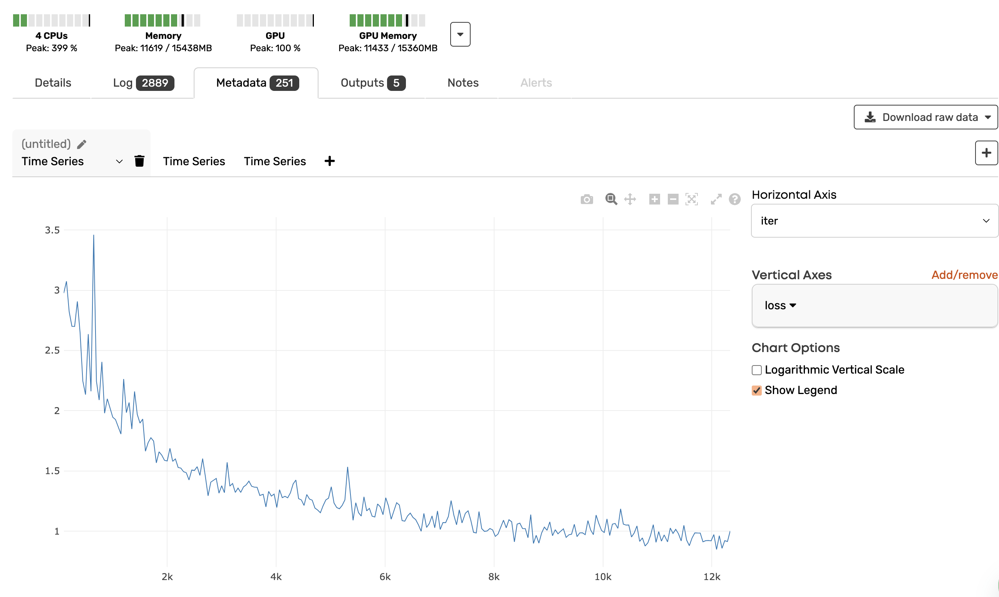

# MMDetection3D with Valohai

This repository demonstrates how to run MMDetection3D on Valohai for 3D object detection tasks. The repository has been adapted for Valohai by introducing a `valohai.yaml` configuration file, utility scripts, and step descriptions that streamline dataset preprocessing and training workflows.

## Key Components

### 1. `valohai.yaml`
The `valohai.yaml` file defines the steps for data preprocessing and model training. It includes all necessary parameters and is generated using the `parameter_dumper.py` script. 

The `valohai.yaml` includes a preconfigured step for training with parameters already generated. You can use this as-is to run jobs on Valohai or customize it for your experiments by modifying the parameters directly in the YAML file.

### 2. `parameter_dumper.py`
This script parses a configuration file from the MMDetection3D `configs` folder and updates `valohai.yaml` with dynamically generated parameters, categorized by sections such as optimizer settings, model configurations, and training hyperparameters.

**Usage:**
Run this script locally to generate or update the `valohai.yaml`. This is especially useful when experimenting with different configurations, as it automates the process of parameter generation for Valohai executions.

### 3. `log_handler.py`
This script monitors the training process by watching for changes in the `scalars.json` file, which contains training metrics. It uses the `watchdog` library to detect updates to the file and computes metrics (e.g., continuous iterations) that are printed and captured in the Valohai logs for real-time visualization.

**Purpose:**
Since MMDetection3D does not output metrics in a Valohai-compatible format by default, this script ensures that the metadata generated during training is properly captured and can be used for monitoring training progress.

### 4. `save_dataset_metadata.py`
This script is used in the `prep_kitti_dataset` step to register the preprocessed KITTI dataset with Valohai's dataset management system. It uses Valohai’s sidecar feature to create and save a versioned dataset, making it available for reuse in subsequent steps like training.

**Purpose:**
It ensures the dataset is available in Valohai’s Data tab, providing easy access for future executions and reproducibility.

## Valoahi Steps Overview

### 1. `prep_kitti_dataset`
This step prepares the KITTI dataset by downloading, unzipping, structuring, and creating a Valohai dataset from the processed data. The step also registers the dataset with Valohai using the `save_dataset_metadata.py` script.

**Key actions:**
- Downloading the KITTI dataset
- Structuring the dataset directories
- Preprocessing the data using the MMDetection3D tool
- Creating a Valohai dataset for reuse in future executions

### 2. `train`
This step trains the model using the preprocessed KITTI dataset. It:
- Extracts the dataset
- Starts the `log_handler.py` script to monitor training metrics
- Runs the training job using the parameters defined in `valohai.yaml`

**Key actions:**
- Initializing the training environment
- Monitoring training metrics in real-time with the `log_handler.py`
- Running the model training with dynamic parameters

## Running MMDetection3D on Valohai

### Setup

1. **Install Valohai CLI:**
   ```bash
   pip install valohai-cli valohai-utils
   ```

2. **Login to Valohai:**
   ```bash
   vh login
   ```

3. **Link or Create a Valohai Project:**
   If the project already exists in your Valohai organization, you can link your local code to it:
   ```bash
   vh project link
   ```
   This command will provide a list of available projects to link to. If the project doesn't exist, you can create a new one:
   ```bash
   vh project create
   ```

4. **Clone this repository:**
   ```bash
   git clone <repository-link> .
   ```

### Running the Pipeline

1. **Run the Data Preprocessing Step:**
   ```bash
   vh execution run prep_kitti_dataset --adhoc
   ```
   


2. **Run the Training Step:**
   Once the dataset is prepared, you can start the training:
   ```bash
   vh execution run train --adhoc
   ```

**Tip:** Feel free to experiment with different parameters in `valohai.yaml` or the Valohai UI before running the training step.

### Monitoring Training Progress
During training, the `log_handler.py` script will print metrics from the `scalars.json` file in real time, allowing you to visualize training progress directly in Valohai.

